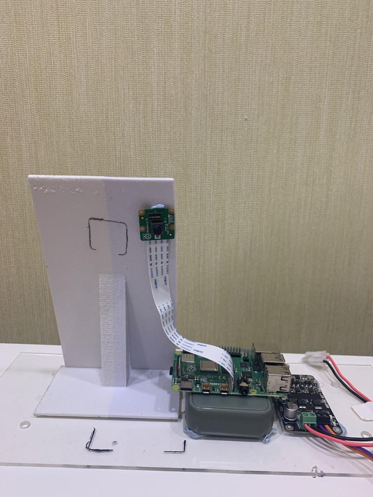
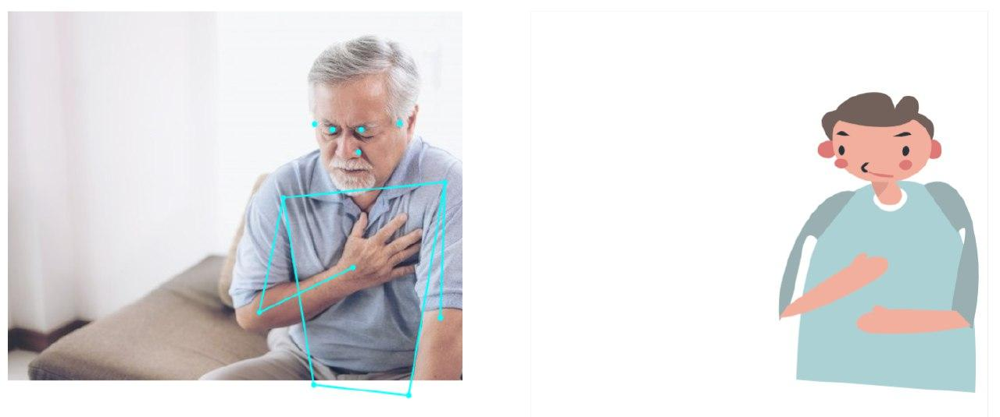

# SCDFHack

**Team name:** Whitespace

**Team description:** We are a team of students from NUS who are passionate about building applications and data science. This led us to join this hackathon together.

**Team members:**

- Chan Dalis
- James Lee
- Jonathan Jie
- Marcus Lee

a) **CareFall** tackles the safety issue of elderly living at home by using IOT and Computer Vision to monitor accidents behind closed doors, such as falls and cardiac arrests.

b) https://youtu.be/cWVEBfaFeDI

c) Our project consists of three principle components.

1. IoT device (RaspberryPi 4 and camera) to capture images and extract the pose estimates. This is done using TensorFlow&#39;s posenet (No video data is sent due to privacy concerns).
2. Pose estimates and fall detection information are sent periodically to a Node + Express REST API hosted on IBM CF. The API records this data and exposes it for the webapp to access.
3. The webapp uses this data and displays it on a dashboard, along with an animation of the current pose. Heart rate and fall detection are displayed.

d) Detailed solution

IoT Hardware

In this proof of concept, we use a RaspberryPi 4 and its included 8MP camera as our image acquisition IoT device.

Image capturing, pose estimation and fall detection

Images were acquired at 5s intervals using the 8MP camera on the RaspberryPi. Pose estimates were then inferred using Posenet ([https://github.com/tensorflow/tfjs-models/tree/master/posenet](https://github.com/tensorflow/tfjs-models/tree/master/posenet)) with ResNet 50 as the embedding network. The pose estimates contain ONLY 17 key points such as the location (within the image) of the eyes, nose, elbows, feet, waist, etc as an array of points. Fall detection is also carried out on the RasperryPi using a simple algorithm that detects the individual&#39;s position relative to the ground. No images are transmitted to the server to preserve the privacy of the individual.

Heart rate and step counting

There are many available APIs for automatic uploading of heartrate and step tracking data to the cloud which can then be obtained and appended to the individual&#39;s data to be displayed over the web app.

CFR Integration

While we did not implement this in our code, we plan to send out an alert to the community care facilities and also the CFR application to signal for people in the neighborhood to check on the individual.

e)

Friday night - Brainstorming of idea

Saturday

- Development of RPI program with PoseNet
- Development of REST API
- Development of webapp

Sunday

- Deployment of services to IBM Cloud

f). To run our demo on your local machine, clone the repository named &quot;front-end&quot; in our organisation &quot;WhitespaceHackers&quot;. Run the following two commands in the terminal:

1. `yarn` to install the dependencies
2. `yarn watch` to start a development server

It is not necessary to run the demo locally. We have deployed our webapp via IBM cloud, so you can access our live app instead. Details are given in step (h).

g). To use the app, you have to click on the first Jane Doe panel. However, in order to get live data the RPI with the camera has to be running and sending data to the API.

h). The web app is our demo. The REST apis provide live pose estimates streamed from the RasperryPi to the server which then pushes the information to the web app which is responsible for displaying the information.

Web:

[https://mdjj-web.us-south.cf.appdomain.cloud/](https://mdjj-web.us-south.cf.appdomain.cloud/)

REST:

[https://mdjj-api.us-south.cf.appdomain.cloud/api](https://mdjj-api.us-south.cf.appdomain.cloud/api)

[https://mdjj-api.us-south.cf.appdomain.cloud/history](https://mdjj-api.us-south.cf.appdomain.cloud/history)

i) IBM Cloud Foundry is being used to host both the API and webapp. Both Cloud Foundry instances are using IBM Cloud&#39;s toolchain which does continuous delivery from our GitHub repo.
